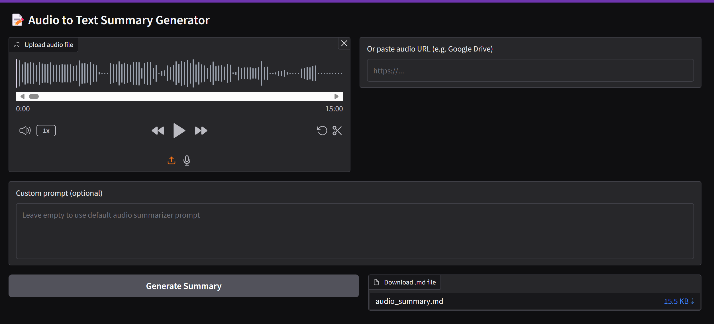

# 📝 Audio_to_text_hf_space
Transcribe audio and generate structured summary using Hugging Face models.
This app supports audio file uploads and Google Drive audio links, and produces clean, markdown-formatted meeting notes powered by Whisper and LLaMA models.
Application includes summarizing podcast, audiobooks and meetings. This will enable geting quick information and determine if its worth listening to the entire audio.

## Features
✅ Upload audio files (.mp3, .wav, .flac) or provide Google Drive links

🧠 Automatic speech-to-text transcription using openai/whisper

📋 Generate summary in markdown:

💡 Powered by a quantized version of Meta's LLaMA model for efficiency

🌐 Gradio interface for easy web-based interaction

🚀 Demo
Try it live on Hugging Face Spaces →

## Launch the app
1. demo.launch(share=True)
2. Inputs:
 - Audio File Upload: Upload an .mp3, .wav, or .flac file

 - Audio URL: Paste a Google Drive or public audio link

 - Prompt (optional): Customize the prompt for LLaMA

3. Output
 - Rendered markdown meeting minutes
 - Downloadable .md file
 

## 📁 File Structure

├── app.py              # Main Gradio interface

├── utils.py            # Helper functions for downloading and validation

├── summarizer.py # Function to generate markdown using LLaMA

├── requirements.txt

├── README.md

⚠️ Notes

Google Drive links must be publicly accessible.

Ensure your audio file is not corrupted and has a valid extension.

LLaMA model loads with 4-bit quantization to reduce memory and improve performance.

## 📌 Roadmap
 1. Add speaker diarization
 2. Support for multi-language transcription
 3. Save history of generated minutes
 4. Provide summary in audio
 5. download summary in pdf

## 🤝 Contributing
Contributions welcome! Open an issue or submit a pull request for improvements or new features.

📜 License
MIT License

